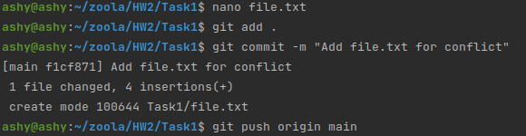
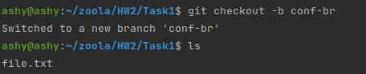
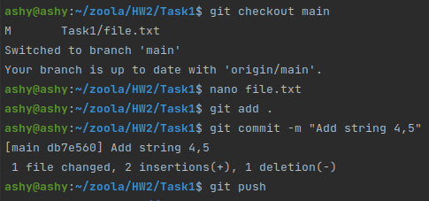
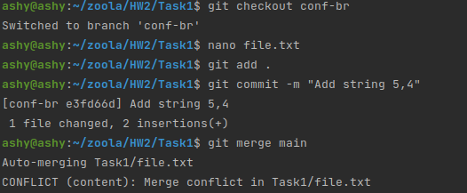
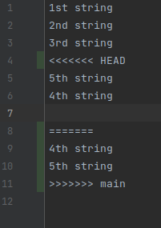
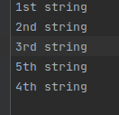
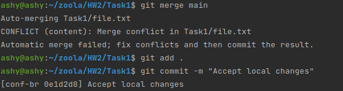
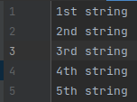
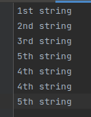

For the beginning i will create file on main and add some strings in it:

Then i will create another branch "conf-br":

Now I will go back to main and make some changes on file:

Now I go to branch "conf-br" and make some changes there:

1. First time – accept local changes instead of remote.

And start to resolve conflict:

2. Second time – accept remote changes instead of local.

Same as 1st task, but remove local changes:

3. Third time – accept both.

