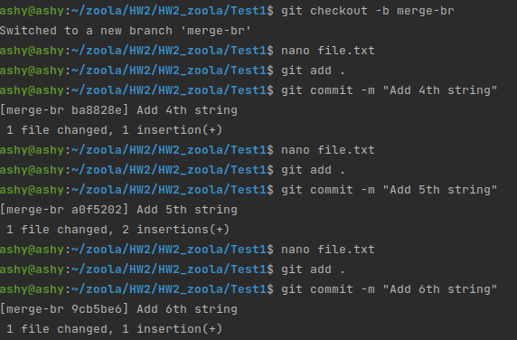
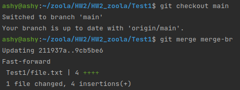
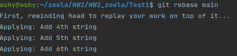

Task2 

Integrate changes from one branch into another branch using:

Git merge and git rebase do almost the same work but in a different way.

1. git merge.

Lets make some commits on main:

Lets create a new branch merge-br

And make some changes in file:

And add some commits:

Now I can go to main and merge changes to main:

2. git rebase.

Rebase is using for change your history off commits in local.

Lets make same as in merge and try "git rebase main"

And:

Questions:

Which command did you like the most?

Git merge. its more useful for team work.

In which cases it is better to use git merge and when git rebase?

Git merge when need changes on remote.

Git rebase only on local to make your history more clean.