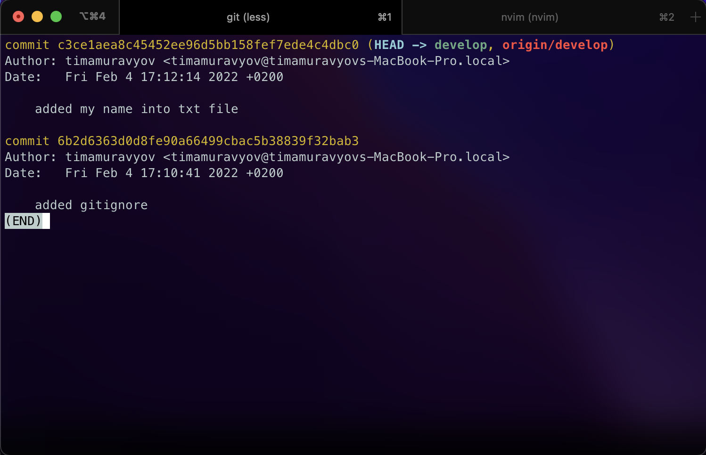

# Task 0
## Short description of completed work:
- Createad githab repo, local direcrory.
- Created new branch.
- Added mac specific file into gitignore and commited it.
- Created txt file with my name and commited it.
- Git push, git log and saved screenshot.

## Git commands that were used
- `git init`
- `git branch -M main`
- `git remote add origin git@github.com:tumophiy/solving-code-wars-problems.git`
- `git checkout -b develop`
- `git add .gitignore`
- `git commit -m "added gitignore"`
- `git add ./self_presentation.txt`
- `git commit -m "added my name into txt file"`
- `git push -u origin main`
- `git log`

## Screenshots

## Conclusion
I have succesfully created repo and pushed 2 files to it.
[Link to repo](https://github.com/tumophiy/solving-code-wars-problems)
