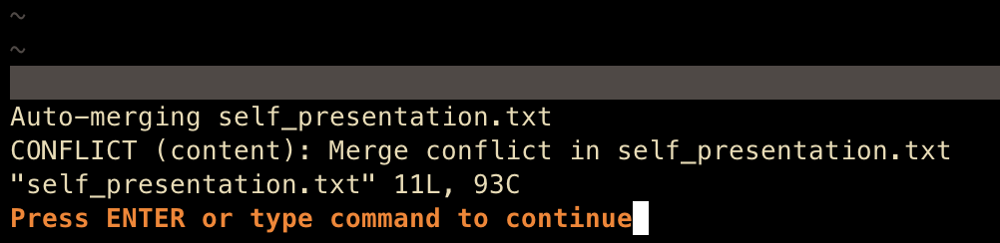
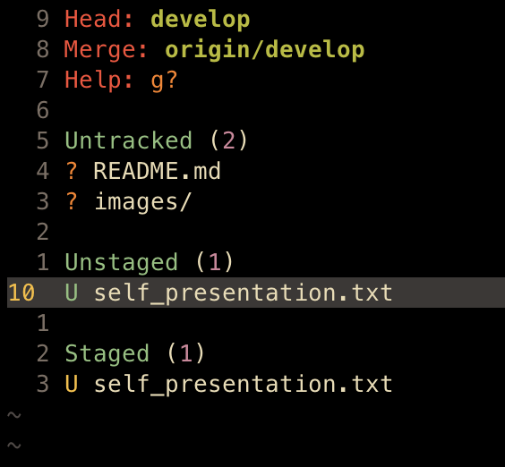
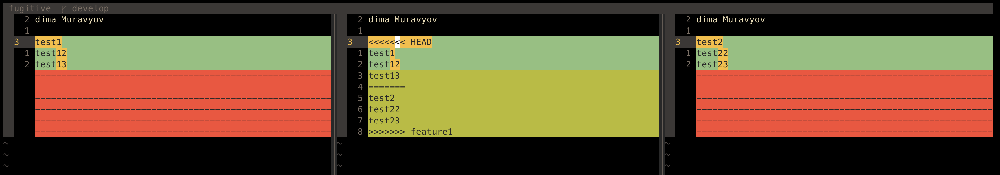
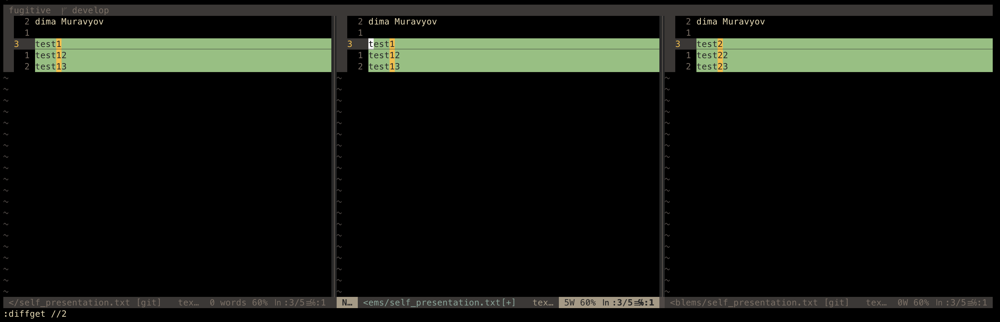
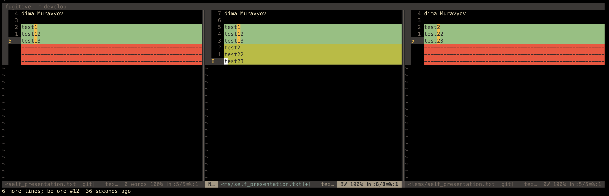
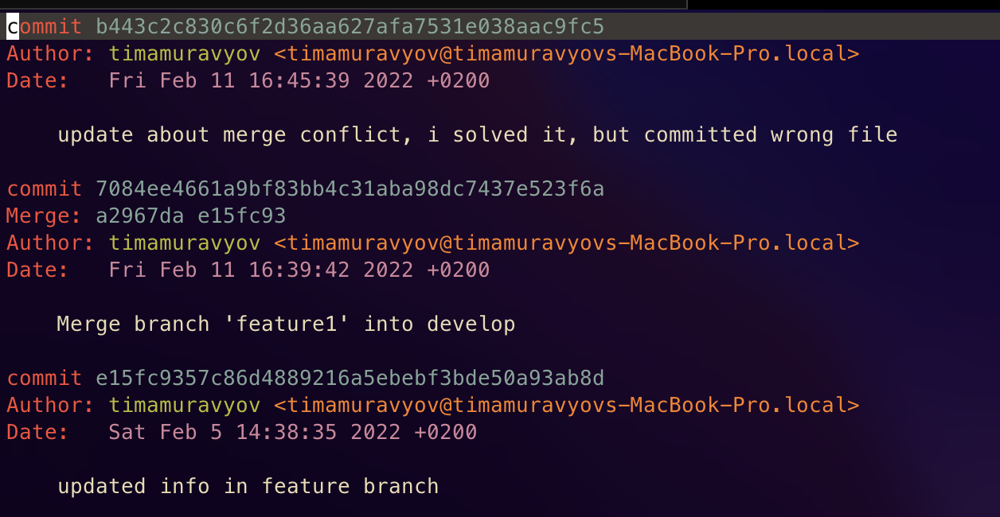
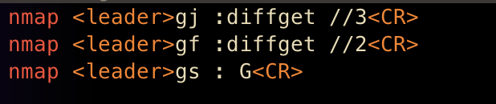

# Task 1

## Short description of completed work:

1. Created new branch and merged it to have conflict.
2. Make changes to file after merge conflict, save it.
3. Commit and push solved conflict.
- control+w-control+o to close this comparison window and go to file
- I'm using vim plug fugitive, that's why almost all of the commands will be different from your setup

## Git commands that were used

- `git checkout -b feature1`
- `git add self_presentation.txt`
- `git commit -m "updated info"`
- `git push -u origin feature1`
- `git checkout develop`
- `git merge feature1`
- `git add self_presentation.txt`
- `git commit`
- `git push`
## Screenshots

press dv

how conflict looks

accepted local changes using <space>df

accepted local changes using <space>dj

both

gitlog

remap that was used
## Conclusion

Remaps are useful but it's not easy to learn them
I initialized only one merge conflict but I get the idea behind solving them.
