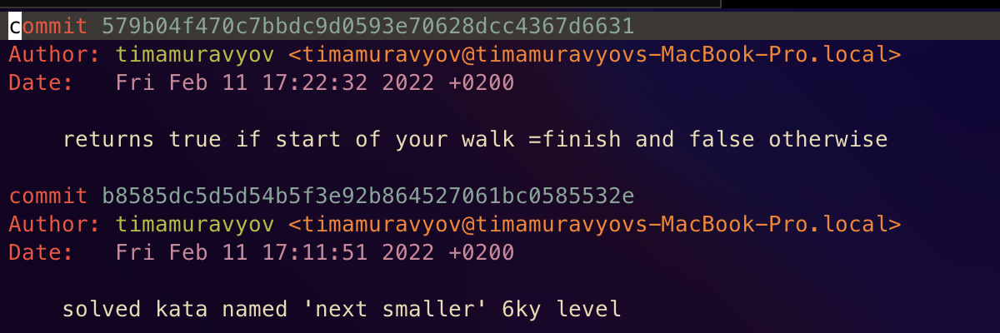

# Task 2
## Short description of completed work:
- Created new branch 'training'
- Added files to 'training', commited, pushed.
- Merged/rebased this branch into develop

## Git commands that were used
- `git checkout -b training`
- `git add`
- `git commit -m "kata"`
- `git push -u origin traing`
- `git checkout develop`
- `git merge training`
- `git rebase training2`

## Screenshots

## Conclusion
For the most of situations `git merge` suits better cause it is cleaner and it doesn't rewrittes whole history of current branch.
