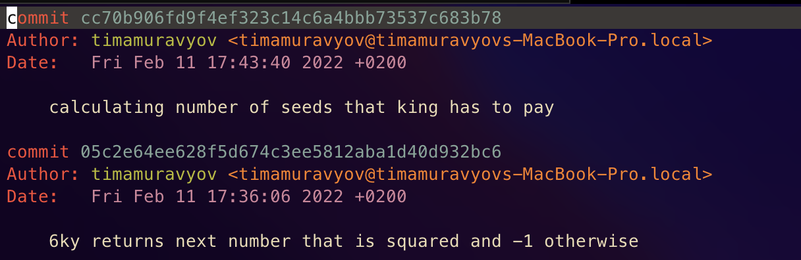

# Task 3
## Short description of completed work:
- Created new branch
- Did 2 commits
- Cherry-pick to main branch

## Git commands that were used
- `git checkout -b training3`
- `git add perfect.rb`
- `git commit`
- `git push -u training3`
- `git add`
- `git commit`
- `git push`
- `git checkout develop`
- `git cherry-pick 'hash'`

## Screenshots

## Conclusion

- `Cherry-pick` is useful for that situations if you happen to push commit to wrong branch.
- Best varient is when you are doing only right commands.
