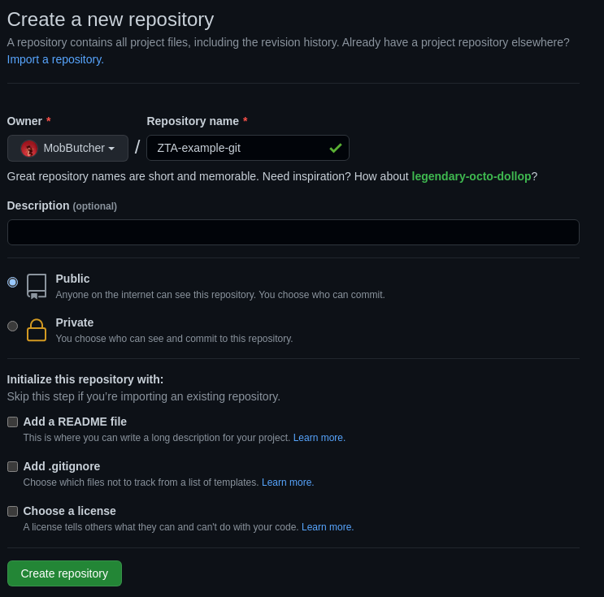

# Task 0

## Creating Github repository

To create a GitHub `git` repository, head over to https://github.com, login, and create one. Don't forget to name it properly. Since I'm creating a "test" repository that I'll use for tinkering with `git` itself and not for "actual" work, I'll name it "ZTA-example-git2". ZoolaTech Academy example repo for lesson `git2`. My apologies to ZoolaTech PR. :P


## Setting it up both on remote and local

You've already set up a remote repository! Now all you need to do is clone it to your machine. To do that, head over to your repository's main page on GitHub and click green `Code` dropdown button. There you can find an HTTPS or SSH link. If you've managed to set up SSH access to GitHub, it is preferable to use that instead, but HTTPS works perfectly fine for now. Either way, head over to the folder you want your cloned repository to reside in (in my case, `cd ~/Documents/GitHub/`) and run `git clone <link>` in your terminal. For example, I used `git clone git@github.com:MobButcher/ZTA-example-git2.git` using my SSH key. Because of that, I also had to paste my password in. If you want to use SSH access, you can start by heading over to [GitHub Docs](https://docs.github.com/en/authentication/connecting-to-github-with-ssh).

## Create a new branch

To create a new branch, you can run `git branch <branch name>`. Then use `git checkout <branch name>` to switch to that branch. Continue with your task and create the files that you need. These are the commands that I used:

```
$ git branch introduction

$ git checkout introduction
Switched to branch 'introduction'
```

P.S. I don't see a reason why I would want to share whole screenshots of a text terminal instead of copying and pasting relevant information directly. Lines starting with `$ ` indicate commands entered. Do not include this prefix in your commands.

## Commit your changes

To `commit` your changes, you must first _stage_ them. You have a few options how you can do that.

- `git add -A`/`git add --all` — Adds all files in your project;
- `git add .` — Adds all files in your current working directory;
- `git add <filename> [filename...]` — Adds files you specified;

You can use `git status` to see what changes you have compared to your current _HEAD_ (which in this case is the latest commit in your repository, most probably, initial commit).

After you've staged your files you can commit them by using `git commit -m "<Commit message>"`. Make sure to write a nice message that briefly, but fully describes what changes were introduced by your commit. Structure your message as if it continues the phrase "This commit will...". Start with a capital letter. You may put periods at the end if you are really into that kind of perversity, but do know that most people will discourage such immoral behaviour.

If you have any leftover, temporary, or test files in your project, please add them in a `.gitignore` file. Do commit it with the rest of your changes. If you're making multiple commits, consider making `.gitignore` change a separate commit.

```
$ git status
On branch introduction
Untracked files:
  (use "git add <file>..." to include in what will be committed)
        Yevhenii-Ponomarenko.md

nothing added to commit but untracked files present (use "git add" to track)

$ git add -A

$ git status
On branch introduction
Changes to be committed:
  (use "git restore --staged <file>..." to unstage)
        new file:   Yevhenii-Ponomarenko.md

$ git commit -m "Create introduction file for Yevhenii Ponomarenko"
[introduction 0b86c5a] Create introduction file for Yevhenii Ponomarenko
 1 file changed, 1 insertion(+)
 create mode 100644 Yevhenii-Ponomarenko.md

$ git status
On branch introduction
nothing to commit, working tree clean
```

## Pushing your changes

To push your changes, use `git push -u origin <branch name>`.
Flag `-u <remote>` will set _upstream_ to `origin`. If it doesn't have branch `<branch name>`, it will be automatically created by GitHub.

```
$ git push
fatal: The current branch introduction has no upstream branch.
To push the current branch and set the remote as upstream, use

    git push --set-upstream origin introduction

$ git push -u origin introduction 
Enter passphrase for key '/home/mobbutcher/.ssh/id_ed25519': 
Enumerating objects: 4, done.
Counting objects: 100% (4/4), done.
Delta compression using up to 2 threads
Compressing objects: 100% (3/3), done.
Writing objects: 100% (3/3), 619 bytes | 619.00 KiB/s, done.
Total 3 (delta 0), reused 0 (delta 0), pack-reused 0
remote: 
remote: Create a pull request for 'introduction' on GitHub by visiting:
remote:      https://github.com/MobButcher/ZTA-example-git2/pull/new/introduction
remote: 
To github.com:MobButcher/ZTA-example-git2.git
 * [new branch]      introduction -> introduction
Branch 'introduction' set up to track remote branch 'introduction' from 'origin'.
```

## Show your `git` logs

To see your `git` logs, use `git log`.

```
$ git log

commit 0b86c5a1bd9e7d8b211d2a0b6a84531d0ce4746c (HEAD -> introduction, origin/introduction)
Author: Mobby Butcher <38690257+MobButcher@users.noreply.github.com>
Date:   Fri Feb 4 15:50:17 2022 +0200

    Create introduction file for Yevhenii Ponomarenko

commit 65f27e66d758ef8e1f217ce14510a9ce9164417d (origin/main, origin/HEAD, main)
Author: Mob Butcher <38690257+MobButcher@users.noreply.github.com>
Date:   Fri Feb 4 13:12:14 2022 +0200

    Delete .gitignore

commit 556934b6b4eb2d3136f7c7987da32ae719580354
Author: Mob Butcher <38690257+MobButcher@users.noreply.github.com>
Date:   Fri Feb 4 13:10:16 2022 +0200

    Initial commit
(END)
```

## Include a link to your repository

Sure! Here you go: [ZTA-example-git2](https://github.com/MobButcher/ZTA-example-git2).
