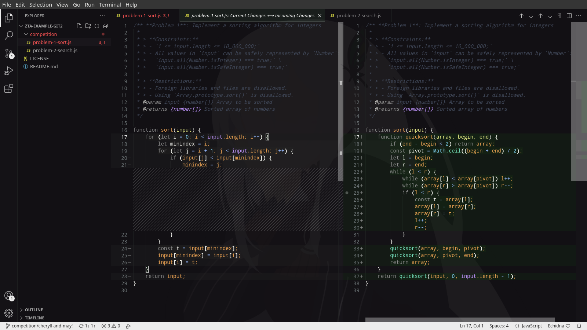
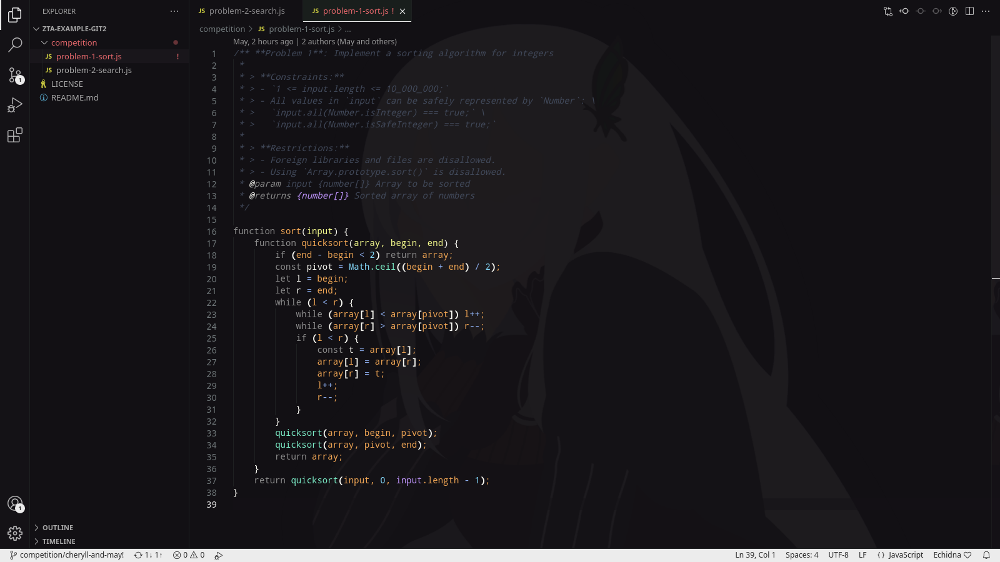
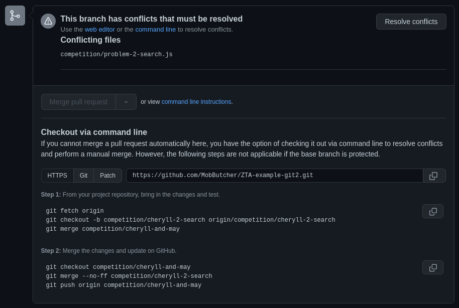
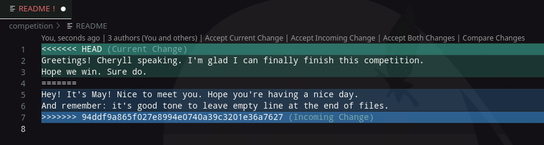
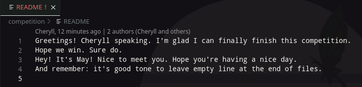

# Task 1

## Creating conflicts


Usually you don't want to create conflicts, but if you and your teammates are working on the same files and same lines, conflicts are bound to happen. _Conflict_ is a situation where multiple commits edit, add, or remove the same lines of code in such a way that `git` is unable to _resolve_ the conflict automatically. This usually happens during _merge_ operations, but they can also occur during _rebase_ or other operations that in one way or another modify the _working tree_.

In this task I will engage in an imaginary competition where a team of two friends, Cheryll and May, will try to solve several problems using `git` and GitHub as their collaboration tools to keep their code synchonized.

Since I am acting on behalf of several users, Cheryll and May, without actually creating several accounts, I will differentiate work done by these users using different authors by modifying commit author names. For reference, I use `git commit` flag `--author="A U Thor <example@example.com>"`.

I will initialize competition directory with boilerplate files to facilitate this scenario. Below shown all the commands that I used to do that and outputs I received. Feel free to skip over them. After that point I will only include partial console logs, assuming that reader has sufficient knowledge of certain commands.

```
$ git branch competition/main

$ git checkout competition/main
Switched to branch 'competition/main'

$ git status
On branch competition/main
Untracked files:
  (use "git add <file>..." to include in what will be committed)
        competition/

nothing added to commit but untracked files present (use "git add" to track)

$ ls competition/
problem-1-sort.js  problem-2-search.js

$ git add competition/problem-1-sort.js

$ git status
Changes to be committed:
  (use "git restore --staged <file>..." to unstage)
        new file:   problem-1-sort.js

Untracked files:
  (use "git add <file>..." to include in what will be committed)
        problem-2-search.js

$ git commit -m "Create boilerplate for 1-st competition problem \"Implement a sorting alforithm for integers\"" --author="Competition Organizers <38690257+MobButcher@users.noreply.github.com>" 
[competition/main 7239810] Create boilerplate for 1-st competition problem "Implement a sorting alforithm for integers"
 Author: Competition Organizers <38690257+MobButcher@users.noreply.github.com>
 1 file changed, 18 insertions(+)
 create mode 100644 competition/problem-1-sort.js

$ git add -A

$ git status
On branch competition/main
Changes to be committed:
  (use "git restore --staged <file>..." to unstage)
        new file:   problem-2-search.js

$ git commit -m "Create boilerplate for 2-nd competition problem \"Implement a search algorithm on a sorted array of integers\"" --author="Competition Organizers <38690257+MobButcher@users.noreply.github.com>" 
[competition/main 4c5bbff] Create boilerplate for 2-nd competition problem "Implement a search algorithm on a sorted array of integers"
 Author: Competition Organizers <38690257+MobButcher@users.noreply.github.com>
 1 file changed, 19 insertions(+)
 create mode 100644 competition/problem-2-search.js
```

With these changes made, this is our current state of `git log`:

```
$ git log

commit 4c5bbffe8ced8c9b4a48c7287f3181f098cd4df0 (HEAD -> competition/main)
Author: Competition Organizers <38690257+MobButcher@users.noreply.github.com>
Date:   Fri Feb 4 17:31:09 2022 +0200

    Create boilerplate for 2-nd competition problem "Implement a search algorithm on a sorted array of integers"

commit 72398100585c1fdff99b69eabff01edc5364b627
Author: Competition Organizers <38690257+MobButcher@users.noreply.github.com>
Date:   Fri Feb 4 17:28:31 2022 +0200

    Create boilerplate for 1-st competition problem "Implement a sorting alforithm for integers"

commit 65f27e66d758ef8e1f217ce14510a9ce9164417d (origin/main, origin/HEAD, main)
Author: Mob Butcher <38690257+MobButcher@users.noreply.github.com>
Date:   Fri Feb 4 13:12:14 2022 +0200

    Delete .gitignore

commit 556934b6b4eb2d3136f7c7987da32ae719580354
Author: Mob Butcher <38690257+MobButcher@users.noreply.github.com>
Date:   Fri Feb 4 13:10:16 2022 +0200

    Initial commit
(END)
```

### Accepting remote changes over local

> Author's note: Due to task requirements, I will create a single branch, `competition/cheryll-and-may`, where both girls will implement their changes. This is done to show how conflicts can occur and how they can be mitigated.

Competition just started, everyone's excited, people `git pull` the competition repo into their working directories. Cheryll _checked out_ the branch `competition/cheryll-and-may` that was created by Competition Organizers for them to work in. Reading the task, she decided to implement a simple selection sort. Just before finishing her work, she just so happened to feel thirsty and went out to pour herself some water into her ZoolaAcademy 2021 branded mug that she just received ([zoolatech.com](https://zoolatech.com)). When she felt confident with her solution, she `git commit`'ed her work and tried to `git push` it. Unfortunately, she faced an issue:

```
$ git push                   
To github.com:MobButcher/ZTA-example-git2.git
 ! [rejected]        competition/cheryll-and-may -> competition/cheryll-and-may (fetch first)
error: failed to push some refs to 'github.com:MobButcher/ZTA-example-git2.git'
hint: Updates were rejected because the remote contains work that you do
hint: not have locally. This is usually caused by another repository pushing
hint: to the same ref. You may want to first integrate the remote changes
hint: (e.g., 'git pull ...') before pushing again.
hint: See the 'Note about fast-forwards' in 'git push --help' for details.
```

Unbeknownst to Cheryll, May has already pushed her solution into the same branch. _Sigh._
Because our commit is based on the tip of `competition/main` and not on May's changes, `git` doesn't allow us to push the changes to the remote as they are. We have to first make sure that our commits begin from the same spot as on the remote. For this, we have to `git pull` the changes to ourselves. Here be dragons:

```
$ git pull        
remote: Enumerating objects: 7, done.
remote: Counting objects: 100% (7/7), done.
remote: Compressing objects: 100% (3/3), done.
Unpacking objects: 100% (4/4), 1.04 KiB | 356.00 KiB/s, done.
remote: Total 4 (delta 1), reused 4 (delta 1), pack-reused 0
From github.com:MobButcher/ZTA-example-git2
   4c5bbff..472ee62  competition/cheryll-and-may -> origin/competition/cheryll-and-may
hint: You have divergent branches and need to specify how to reconcile them.
hint: You can do so by running one of the following commands sometime before
hint: your next pull:
hint: 
hint:   git config pull.rebase false  # merge (the default strategy)
hint:   git config pull.rebase true   # rebase
hint:   git config pull.ff only       # fast-forward only
hint: 
hint: You can replace "git config" with "git config --global" to set a default
hint: preference for all repositories. You can also pass --rebase, --no-rebase,
hint: or --ff-only on the command line to override the configured default per
hint: invocation.
fatal: Need to specify how to reconcile divergent branches.
```

We have good news and bad news. Bad news: we have to resolve the conflict. Good news: `git` tells us exactly how to do it. Of course, setting config options as default would be a nice thing to do in a long-term scenario, and you are free to do so if you wish, but here we are only interested in seeing how to solve the conflict for this specific invocation of `git pull`. Thus we are once again going digging into the `man` pages of `git`. `git help pull`, to be specific.
For our purposes, we are going to use the `--no-rebase` flag.

```
$ git pull --no-rebase  
Auto-merging competition/problem-1-sort.js
CONFLICT (content): Merge conflict in competition/problem-1-sort.js
Automatic merge failed; fix conflicts and then commit the result.
```

This is a perfect time to let you in on a secret. Ready? _You don't have to use terminal to do everything!_ Although it's a nice skill to be able to perform all of the operations described in this document from terminal, you don't have to. Personally, I'm using VSCode to perform everything in this scenario.
Since automatic merge failed, `git` starts manual merge process. This usually launches a file in the file editor and waits for it to be closed. This is what I have on my screen:



> P.S.: I've just finished watching Re:Zero.

As you can see, the file now contains both versions of the conflicting code surrounded by _merge markers_. You can read more about _merge markers_ and _merge process_ in `git help merge`, sections `HOW CONFLICTS ARE PRESENTED` and `HOW TO RESOLVE CONFLICTS` respectively.

- `<<<<<<<` starts a conflicting section, after which (usually) "our" (current) side is presented.
- `|||||||`, if present, finishes previous section and starts original part that was present in the working tree before merge began.
- `=======` finishes previous section and starts (usually) "their" (incoming) side of changes.
- `>>>>>>>` finishes previous section and merge conflict overall.

To proceed with a merge, simply select the part that you wish to keep and remove everything else, including all of the merge markers. Namely, to select "our" (current) side, leave only code between `<<<<<<<` and `=======`; to select "their" (incoming) side, leave only code between `=======` and `>>>>>>>`. Remove the markers. When you finished, the file you are left up with must be as working as it was before, meaning that it must compile/work as a proper file.

May's solution is better: it uses better algorithm, thus being better fit for our current purpose — winning the competition. Thus, Cheryll decided to choose incoming side and leave May's changes intact. In VSCode with GitLens plugin installed doing so is as simple as clicking "Accept incoming change" at the starting merge marker.


After that you can finish the merge process by running `git merge --continue`. If all conflicts are resolved, merge will be finalized and put in a separate merge commit. I've used `git commit`, though, because I wanted to include `--author` flag in my specific case. This finished the merge process.

```
$ git add problem-1-sort.js

$ git commit -m "Accept quicksort solution to competition task 1" --author="Cheryll <38690257+MobButcher@users.noreply.github.com>"
[competition/cheryll-and-may 36efb88] Accept quicksort solution to competition task 1
 Author: Cheryll <38690257+MobButcher@users.noreply.github.com>
```

```
$ git log

commit 36efb884677fcdf231b0e055c91dfcfa7e03b5fb (HEAD -> competition/cheryll-and-may)
Merge: 2fa3278 472ee62
Author: Cheryll <38690257+MobButcher@users.noreply.github.com>
Date:   Fri Feb 4 21:00:57 2022 +0200

    Accept quicksort solution to competition task 1

commit 2fa3278c3fabb9902f4578a1e613d3fb99803ccc
Author: Cheryll <38690257+MobButcher@users.noreply.github.com>
Date:   Fri Feb 4 19:32:44 2022 +0200

    Implement selection sort solution to competition task 1

commit 472ee628ea94a1391685f7d838ecf757832ced79 (origin/competition/cheryll-and-may)
Author: May <38690257+MobButcher@users.noreply.github.com>
Date:   Fri Feb 4 19:16:18 2022 +0200

    Implement quicksort solution to competition task 1

commit 4c5bbffe8ced8c9b4a48c7287f3181f098cd4df0 (origin/competition/main, competition/main)
Author: Competition Organizers <38690257+MobButcher@users.noreply.github.com>
Date:   Fri Feb 4 17:31:09 2022 +0200

    Create boilerplate for 2-nd competition problem "Implement a search algorithm on a sorted array of integers"

// Output trimmed for brevity
```

### Accepting local changes over remote

> _Cheryll sighed into the phone that she was holding between her cheek and shoulder while typing away._
> — Alright, May, it's nice that we have a place to share our code, but I just had to resolve a merge conflict because you pushed to the repo first. Let's create branches and make pull requests instead, alright?
> — _Sure. I'll quickly do that then. See you._

With that, Cheryll began working on the second problem. Seeing that it was a search problem, she almost thought of a naïve solution, but then she noticed an important detail: the input is _sorted_. Perfect use case for binary search. And thus she started making chang- waaaaait a minute, new branch first, as she agreed with May... Whoops.

```
$ git branch competition/cheryll-2-search

$ git checkout competition/cheryll-2-search
Switched to branch 'competition/cheryll-2-search'
```

_Now_ we can start working on our code.

```
$ git all problem-2-search.js
$ git commit -m "Implement binary search solution to competition task 2" --author="Cheryll <38690257+MobButcher@users.noreply.github.com>"

$ git push -u origin competition/cheryll-2-search
Enumerating objects: 17, done.
Counting objects: 100% (17/17), done.
Delta compression using up to 2 threads
Compressing objects: 100% (13/13), done.
Writing objects: 100% (13/13), 2.71 KiB | 396.00 KiB/s, done.
Total 13 (delta 7), reused 0 (delta 0), pack-reused 0
remote: Resolving deltas: 100% (7/7), completed with 2 local objects.
remote: 
remote: Create a pull request for 'competition/cheryll-2-search' on GitHub by visiting:
remote:      https://github.com/MobButcher/ZTA-example-git2/pull/new/competition/cheryll-2-search
remote: 
To github.com:MobButcher/ZTA-example-git2.git
 * [new branch]      competition/cheryll-2-search -> competition/cheryll-2-search
Branch 'competition/cheryll-2-search' set up to track remote branch 'competition/cheryll-2-search' from 'origin'.
```

Finally, a clean `git push` without any problems. Now let's follow the link and create a _pull request_.


May! You wholesome daughter of your mother, you did it again! Grrrr... Now Cheryll has to fix the conflict once again. As you can see, GitHub provides following instructions to resolve that conflict manually, using local tools:

```
Step 1: From your project repository, bring in the changes and test.
git fetch origin
git checkout -b competition/cheryll-2-search origin/competition/cheryll-2-search
git merge competition/cheryll-and-may

Step 2: Merge the changes and update on GitHub.
git checkout competition/cheryll-and-may
git merge --no-ff competition/cheryll-2-search
git push origin competition/cheryll-and-may
```

Let's do exactly that.

```
$ git fetch
remote: Enumerating objects: 8, done.
remote: Counting objects: 100% (8/8), done.
remote: Compressing objects: 100% (2/2), done.
Unpacking objects: 100% (5/5), 1.25 KiB | 106.00 KiB/s, done.
remote: Total 5 (delta 3), reused 4 (delta 3), pack-reused 0
From github.com:MobButcher/ZTA-example-git2
   36efb88..e9d8497  competition/cheryll-and-may -> origin/competition/cheryll-and-may
 * [new branch]      competition/may-2-search -> origin/competition/may-2-search

// No checkout to competition/cheryll-2-search because we are already checked out into it.
// Instead we will check out competition/cheryll-and-may and pull changes into our branch.

$ git checkout competition/cheryll-and-may
Switched to branch 'competition/cheryll-and-may'
Your branch is behind 'origin/competition/cheryll-and-may' by 2 commits, and can be fast-forwarded.
  (use "git pull" to update your local branch)

$ git pull
Updating 36efb88..e9d8497
Fast-forward
 competition/problem-2-search.js | 8 ++++++--
 1 file changed, 6 insertions(+), 2 deletions(-)

$ git checkout competition/cheryll-2-search

$ git merge competition/cheryll-and-may
Auto-merging competition/problem-2-search.js
CONFLICT (content): Merge conflict in competition/problem-2-search.js
Automatic merge failed; fix conflicts and then commit the result.
```

Once again we've stumbled upon a manual merge. This time our solution is better, so we choose ours. "Accept current changes" and commit the merge.

```
$ git add -A
$ git commit -m "Merge: Accept binary search solution to competition task 2" --author="Cheryll"

$ git log

commit acd4d658e6cc28970a28fc2f122f4076c21b9436 (HEAD -> competition/cheryl
l-2-search)
Merge: 0506497 e9d8497
Author: Cheryll <38690257+MobButcher@users.noreply.github.com>
Date:   Fri Feb 4 22:18:08 2022 +0200

    Merge: Accept binary search solution to competition task 2

commit 050649702afbe8b041b39371bd19ad76fc415b25 (origin/competition/cheryll-2-search)
Author: Cheryll <38690257+MobButcher@users.noreply.github.com>
Date:   Fri Feb 4 21:52:31 2022 +0200

    Implement binary search solution to competition task 2

commit e9d84971e5acf58a825e5c2e65c9f5594a324ee2 (origin/competition/cheryll-and-may, competition/cheryll-and-may)
Merge: 36efb88 87848f1
Author: Mob Butcher <38690257+MobButcher@users.noreply.github.com>
Date:   Fri Feb 4 21:25:54 2022 +0200

    Merge pull request #1 from MobButcher/competition/may-2-search
  
    [May] Solve problem 2 for competition

commit 87848f1485859ed6f3e1a45dda586bebdbad65c5 (origin/competition/may-2-search)
Author: May <38690257+MobButcher@users.noreply.github.com>
Date:   Fri Feb 4 21:20:18 2022 +0200

    Implement naive solution to competition task 2

commit 36efb884677fcdf231b0e055c91dfcfa7e03b5fb
Merge: 2fa3278 472ee62
Author: Cheryll <38690257+MobButcher@users.noreply.github.com>
Date:   Fri Feb 4 21:00:57 2022 +0200

    Accept quicksort solution to competition task 1

// Output trimmed for brevity
```

I decided to merge the result through GitHub. Thus, I simply `git push`ed the changed and went to PR page to close it.

```
$ git log

commit 279dcb7d27d59eb6ee652743250ebe3e505bc842 (HEAD -> competition/cheryll-and-may, origin/competition/cheryll-and-may)
Merge: e9d8497 acd4d65
Author: Mob Butcher <38690257+MobButcher@users.noreply.github.com>
Date:   Fri Feb 4 22:26:07 2022 +0200

    Merge pull request #2 from MobButcher/competition/cheryll-2-search
  
    [Cheryll] Implement binary search solution to competition task 2

commit acd4d658e6cc28970a28fc2f122f4076c21b9436 (origin/competition/cheryll-2-search, competition/cheryll-2-search)
Merge: 0506497 e9d8497
Author: Cheryll <38690257+MobButcher@users.noreply.github.com>
Date:   Fri Feb 4 22:18:08 2022 +0200

    Merge: Accept binary search solution to competition task 2

commit 050649702afbe8b041b39371bd19ad76fc415b25
Author: Cheryll <38690257+MobButcher@users.noreply.github.com>
Date:   Fri Feb 4 21:52:31 2022 +0200

    Implement binary search solution to competition task 2

commit e9d84971e5acf58a825e5c2e65c9f5594a324ee2
Merge: 36efb88 87848f1
Author: Mob Butcher <38690257+MobButcher@users.noreply.github.com>
Date:   Fri Feb 4 21:25:54 2022 +0200

    Merge pull request #1 from MobButcher/competition/may-2-search
  
    [May] Solve problem 2 for competition

commit 87848f1485859ed6f3e1a45dda586bebdbad65c5 (origin/competition/may-2-search)
Author: May <38690257+MobButcher@users.noreply.github.com>
Date:   Fri Feb 4 21:20:18 2022 +0200

    Implement naive solution to competition task 2

// Output trimmed for brevity
```

### Accepting both local and remote changes

Competition is nothing if you don't know its participants, right? Let's make a file where our girls can both share a bit more about themselves.
Let's see what happens if two people create the same file simultaneously. `README` sounds like an obvious choice, so let's imagine that both Cheryll and May decided to create this file from the top of our current `competition/cheryll-and-may` branch. Then I will just push changes directly into that branch on the remote. The reasons for that are:

- It already took me 10 hours to do everything described here;
- `git pull` conflicts are much quicker to do this way, which is not what we want in general, but exactly what we are looking for right now;
- It's just for example anyway;
- Please don't do this at home. Instead, create branches and pull request them into the main repository.

Of course, May was quicker and pushed her changes first, with merge conflicts left to Cheryll. Imagine if _you_ had to fix three merge conflicts in a row... You know where this is going.

```
$ git commit -am "Add README file for Cheryll" --author="Cheryll"
[competition/cheryll-and-may 13163d3] Add README file for Cheryll
 Author: Cheryll <38690257+MobButcher@users.noreply.github.com>
 1 file changed, 2 insertions(+)
 create mode 100644 competition/README

$ git push
To github.com:MobButcher/ZTA-example-git2.git
 ! [rejected]        competition/cheryll-and-may -> competition/cheryll-and-may (fetch first)
error: failed to push some refs to 'github.com:MobButcher/ZTA-example-git2.git'
hint: Updates were rejected because the remote contains work that you do
hint: not have locally. This is usually caused by another repository pushing
hint: to the same ref. You may want to first integrate the remote changes
hint: (e.g., 'git pull ...') before pushing again.
hint: See the 'Note about fast-forwards' in 'git push --he·lp' for details.

$ git pull --no-rebase
Auto-merging competition/README
CONFLICT (add/add): Merge conflict in competition/README
Automatic merge failed; fix conflicts and then commit the result.
```

And now in our VSCode window we see both changes.


Once again, we select an option provided by GitLens. This time it's "Accept both changes". Here's the result:


With that all that's left is to commit the changes and push them to the remote. This time let's not add a message name and instead see what the default looks like.

```
$ git commit -a --author="Cheryll"
$ git push

$ git log

commit 88604877527bd59a6d273cc74e25f97e65436327 (HEAD -> competition/cheryll-and-may, origin/competition/cheryll-and-may)
Merge: 13163d3 94ddf9a
Author: Cheryll <38690257+MobButcher@users.noreply.github.com>
Date:   Fri Feb 4 23:42:51 2022 +0200

    Merge branch 'competition/cheryll-and-may' of github.com:MobButcher/ZTA-example-git2 into competition/cheryll-and-may

commit 13163d32fd92c1e33a54675bffe5eb8db7e2c93c
Author: Cheryll <38690257+MobButcher@users.noreply.github.com>
Date:   Fri Feb 4 23:26:17 2022 +0200

    Add README file for Cheryll

commit 94ddf9a865f027e8994e0740a39c3201e36a7627
Author: May <38690257+MobButcher@users.noreply.github.com>
Date:   Fri Feb 4 23:20:44 2022 +0200

    Add README file for May

commit 279dcb7d27d59eb6ee652743250ebe3e505bc842
Merge: e9d8497 acd4d65
Author: Mob Butcher <38690257+MobButcher@users.noreply.github.com>
Date:   Fri Feb 4 22:26:07 2022 +0200

    Merge pull request #2 from MobButcher/competition/cheryll-2-search
    
    [Cheryll] Implement binary search solution to competition task 2

// Output trimmed for brevity
```

## Conclusions

- GitLens is a godsent.
- Always `git fetch` before `push`ing.
- New branches. Pull requests. Please.
- GitHub doesn't display custom author names. ;-;
- I'm done with this task.

Once again, the repo is available at [ZTA-example-git2](https://github.com/MobButcher/ZTA-example-git2).