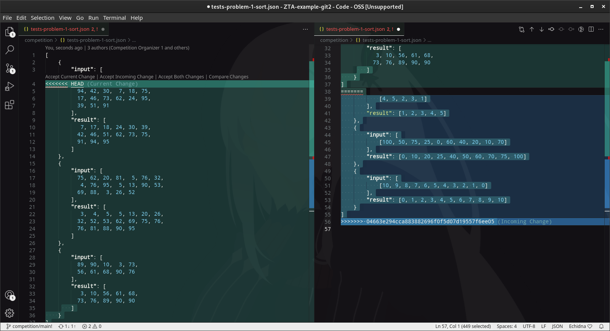
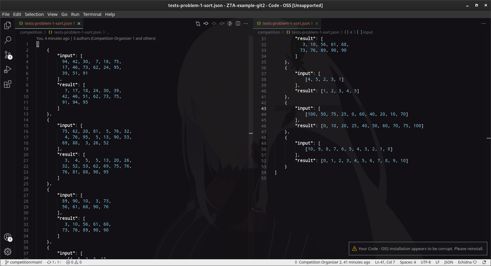
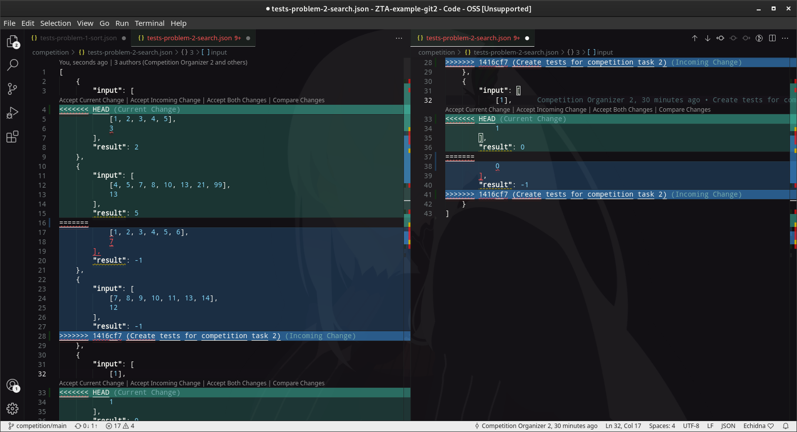
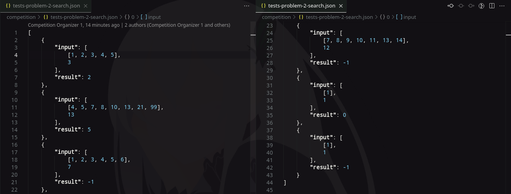

# Task 2

## Merge vs Rebase

Competition is in full swing, but we just realized that we don't have any tests for people to test their code with! Let's create some simple `tests-problem-N.json` files that contains all the necessary data. This time instead of Cheryll and May we will have Contest Organizer 1 and Contest Organizer 2, because they really like their privacy. Once again, to keep things simple and to force conflicts quicker, both will push into the same branch, `competition/main`. Do keep in mind that in production you would want to create a new branch for each change and create Pull Request. To see how conflict resolution differs when conflict occurs in Pull Request, see `task-1.md`, chapter 2: `### Accepting local changes over remote`.

### Resolving conflicts with merge

Setup is simple:
- Contest Organizer 2 (CO2) creates `tests-problem-1-sort.json`, fills it with tests, and pushes it to the remote.
- Contest Organizer 1 (CO1) creates the same file and also fills it with tests, committing the changes.
- CO1 tries to push the changes, but has to pull what CO2 did first.

Here's what we get after `git pull --no-rebase`:


Let's just say that this was a messy conflict that required manual editing to get it right. Lines 2 and 3 were merged together, but they should have been present two times, one for each commit. I've pasted them verbatim at lines 36 and 37, also removing extra opening and closing brackets that were wrongly duplicated. Here's the end result:


### Resolving conflicts with rebase

Same story, different file: `tests-problem-2-search.json`.

Now we perform `git pull --rebase`. Here's what's happening:


Unfortunately, it is also messy. Manually fixing up changes yields us this result:


After all our ordeals this is what we have in our `git log`:
P.S.: I made a stupid mistake during merge: forgot to save the file before committing it. :\ That's why there is a "fixup!" commit there.
```
commit 30e5a37ec22d615e521d514340cfcf05dedf30d3 (HEAD -> competition/main, origin/competition/main)
Author: Mobby Butcher <38690257+MobButcher@users.noreply.github.com>
Date:   Sat Feb 5 02:37:32 2022 +0200

    fixup! Merge tests for competition task 1

commit 5a669e356dcd26409de7a44e0a282966b607d729
Author: Competition Organizer 1 <38690257+MobButcher@users.noreply.github.com>
Date:   Sat Feb 5 02:28:21 2022 +0200

    Merge tests for competition task 2

commit ff3bc3a9263123cde942198c18aa83f75bf8fa66
Author: Competition Organizer 2 <38690257+MobButcher@users.noreply.github.com>
Date:   Sat Feb 5 02:02:34 2022 +0200

    Create tests for competition task 2

commit cfc8226da7959eba3282a915d5eaefb505f6b5ac
Merge: c93b6ce 04663e2
Author: Competition Organizer 1 <38690257+MobButcher@users.noreply.github.com>
Date:   Sat Feb 5 02:17:28 2022 +0200

    Merge tests for competition task 1

commit c93b6cee78dd8fb27bc256b6af1898ca93b2246d
Author: Competition Organizer 1 <38690257+MobButcher@users.noreply.github.com>
Date:   Sat Feb 5 02:15:04 2022 +0200

    Create tests for competition task 1

commit 04663e294cca883882696f0f5d07d19557f6ee05
Author: Competition Organizer 2 <38690257+MobButcher@users.noreply.github.com>
Date:   Sat Feb 5 00:28:26 2022 +0200

    Create tests for competition task 1

// Output trimmed for brevity
```

## Conclusions
There are two questions: "Which command did you like the most?" and "In which cases it is better to use `git merge` and when `git rebase`?" I'll answer them both in one go.
I liked `--no-rebase` more because it's non-destructive. It keeps all of the changes intact, instead creating a whole new commit for changes made during conflict resolution. This keeps the history more preserved and organized, and with right naming it would also keep it cleaner.
`--rebase` is only useful if you know that you won't get any conflicts. That way you can, well, _rebase_ in case there were some changes made in history that don't change anything in the files themselves. For example, I have extensively used authorship metadata manipulation to make my changes all that much more immersive for all of you who would ever decide to `git clone` this repo and look into it for yourself.

With all that done what I can say right now is this: rebase sucks. Use it only if necessary. I've accidentally lost one of my commits because of it while I was fighting the hellscape I've turned my local repos into. Please don't make my mistakes. If you see that your rebase doesn't go through automatically, `--abort` it away and forget about that nightmare.