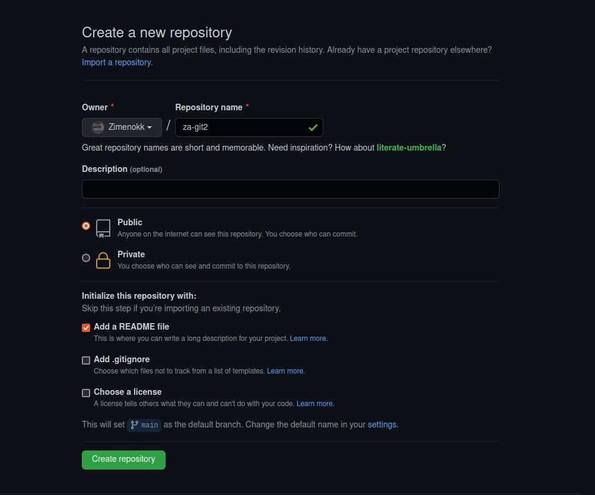

# Task0
----------

## 1. Create new public repo in github.

----------
## 2. Set it up both remote and local.
Remote setup: I took the ssh-link in the repository and pasted it into the terminal.
The commands I used in the terminal:
~~~~
git clone git@github.com:Zimenokk/za-git2.git
git commit -m "Init repo"
На ветке master

Начальный коммит

~~~~
----------
## 3. Create new branch.
~~~~
git branch hw-view
git checkout hw-view
Переключено на ветку «hw-view»

~~~~
----------
## 4. Create text file with your name and surname.
I created new text file with 
~~~~
nano name.txt
~~~~
----------
## 5. Commit it && Push your branch.
~~~~
$ git push origin -u hw-view
Перечисление объектов: 7, готово.
Подсчет объектов: 100% (7/7), готово.
При сжатии изменений используется до 8 потоков
Сжатие объектов: 100% (4/4), готово.
Запись объектов: 100% (6/6), 45.05 КиБ | 45.05 МиБ/с, готово.
Всего 6 (изменения 0), повторно использовано 0 (изменения 0)
To github.com:Zimenokk/za-git2.git
   a5acb96..8cf0f9f  hw-view -> hw-view
Ветка «hw-view» отслеживает внешнюю ветку «hw-view» из «origin».
~~~~
----------
## 5. Git logs.
~~~~
Author: zimenokk <dzimenokk@gmail.com>
Date:   Thu Feb 10 19:03:18 2022 +0200

    Add gitignore file

commit a5acb963962c1089ef51a92ef6372574c6b5a37a (master)
Author: zimenokk <dzimenokk@gmail.com>
Date:   Thu Feb 10 18:32:55 2022 +0200

    Add name file
~~~~

## 6. Welcome to my git_2 repo 
[GIT_2 REPo](https://github.com/Zimenokk/za-git2)
