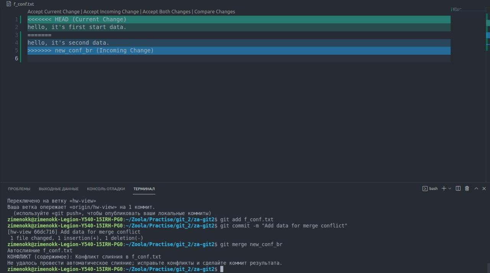
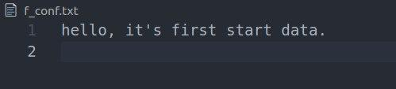
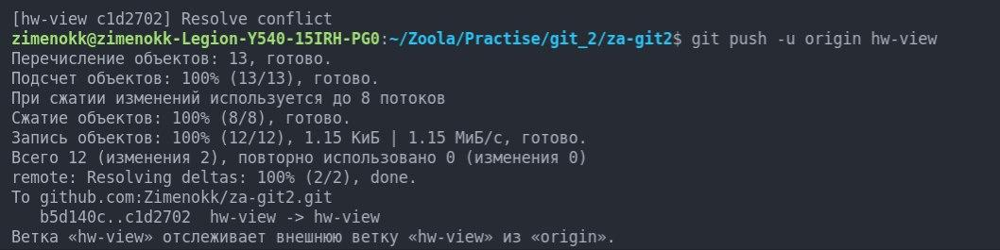
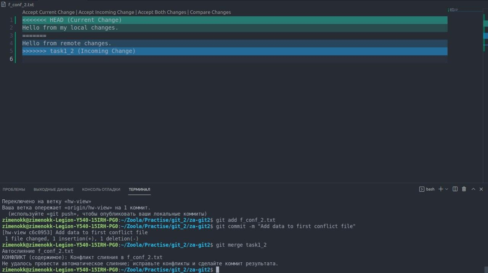
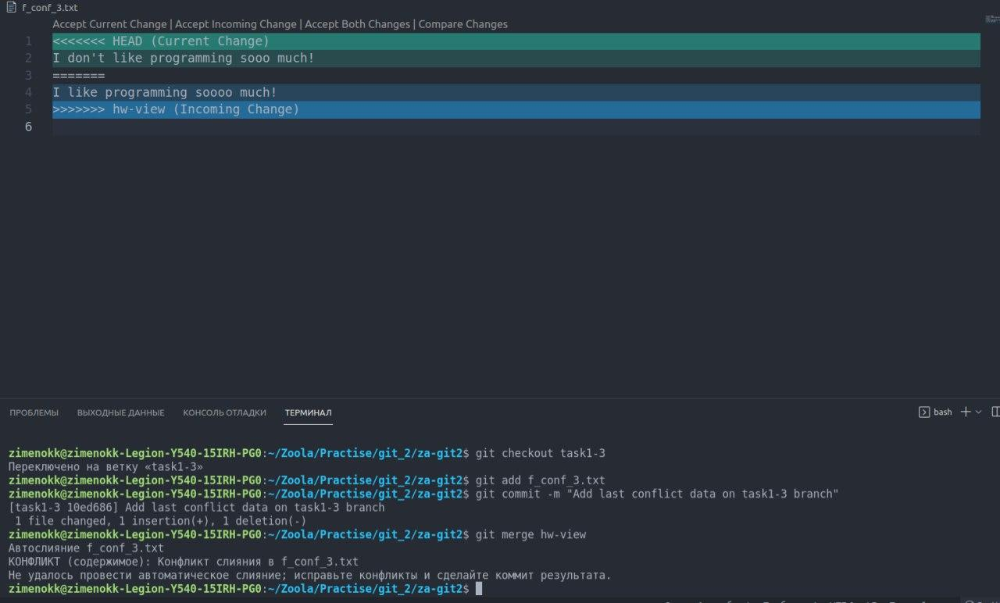
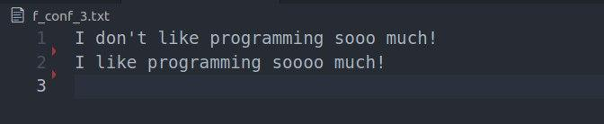

# Task 1: Solving conflicts
----
## First time – accept local changes instead of remote.
I created a file `f_conf.txt` on the hw-view branch, wrote a line into it.
I switched to the `new_conf_br` branch, where I changed one line in our file, then switched back to hw-view and ran merge. That's how I created the conflict.

I need to apply `local changes`, so from the three options (Accept current change, Accept incoming change, Accept both changes, Compare changes) I will choose the first one - `Accept current change`

----
## Second time – accept remote changes instead of local.
I created two files again, did the steps from the previous point.

~~~~
git merge task1_2
Автослияние f_conf_2.txt
КОНФЛИКТ (содержимое): Конфликт слияния в f_conf_2.txt
Не удалось провести автоматическое слияние; исправьте конфликты и сделайте коммит результата.
~~~~
In this case we select `Accept incoming changes` and resolve the conflict.

----
## Third time – accept both.
I created two files again, did the steps from the previous point.

~~~~
git merge hw-view
Автослияние f_conf_3.txt
КОНФЛИКТ (содержимое): Конфликт слияния в f_conf_3.txt
Не удалось провести автоматическое слияние; исправьте конфликты и сделайте коммит результата.
~~~~

To resolve this conflict I chose `Accept both changes`
and made a `commit`

-----