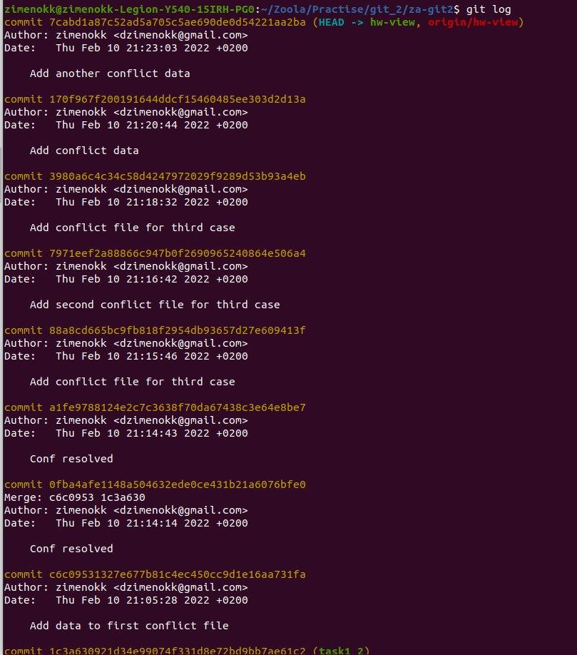
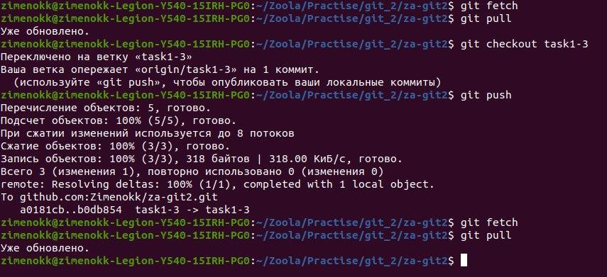
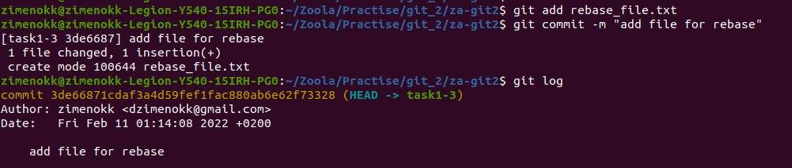
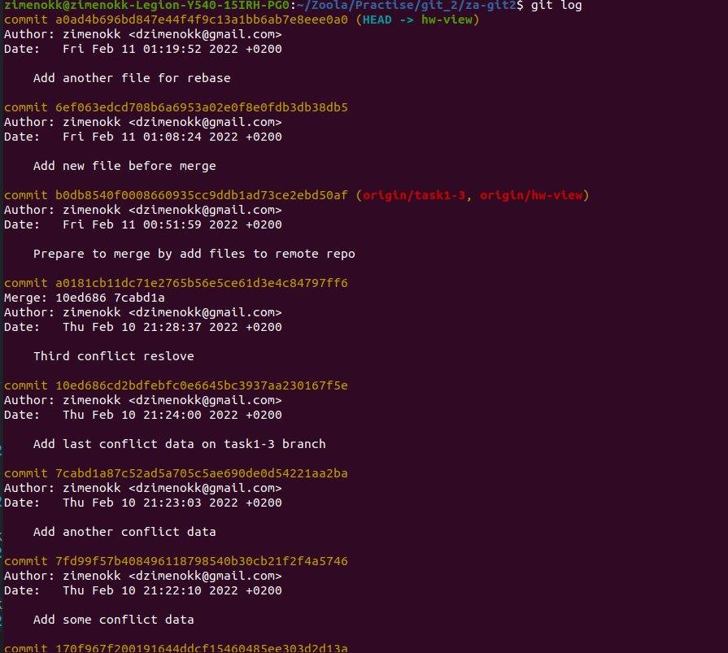
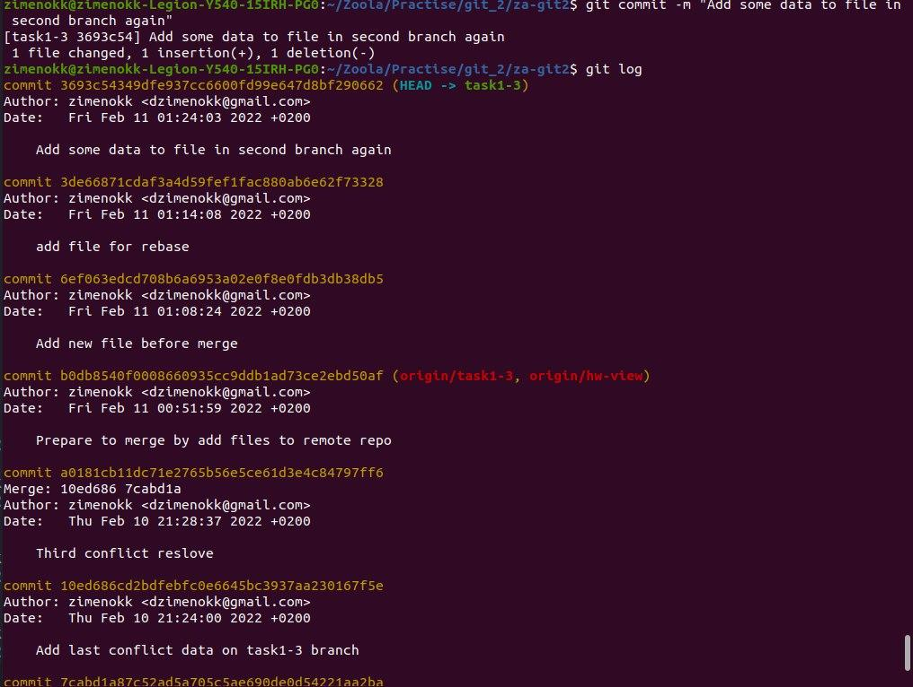
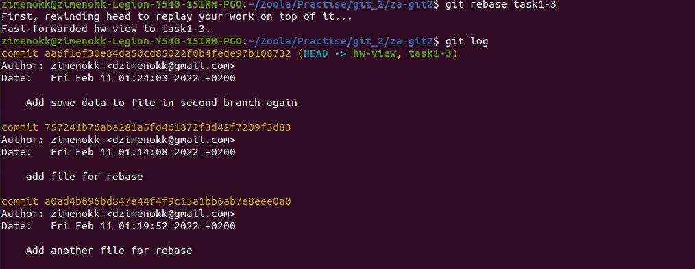

# Task 2: Merge vs Rebase

Integrate changes from one branch into another branch using:

`git merge`
`git rebase`

----
## Merge
Before you run git merge, you should make sure that the receiving branch and the branch to merge are ready.
I did this with `git fetch` and `git pull`

~~~~
git merge task1-3
Обновление 7cabd1a..b0db854
Fast-forward
 f_conf_3.txt | 3 ++-
 1 file changed, 2 insertions(+), 1 deletion(-)

~~~~

Merge was successful.

----
## Rebase

Before starting `Rebase`, I created a new file in the `task1-3` branch

I also added another file to the `hw-view` branch

I added some info to file in `task1-3` branch

And so, you can see from the `git log` of the `hw-view` branch that the `git rebase` was successful.

----
# Questions
### 1. Which command did you like the most?
I like `git merge` better because it's easier, safer for larger projects, and keeps a history of commits.
### 2.In which cases it is better to use `git merge` and when `git rebase`?
I think `git merge` is more useful for larger projects where you want to keep project history and avoid overwriting commits.

----
# SO
`git merge` is a Tony Stark in the branch merge world, he is really good one.