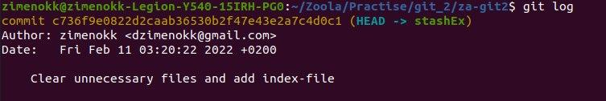
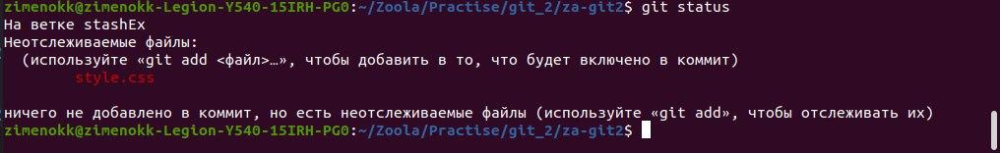
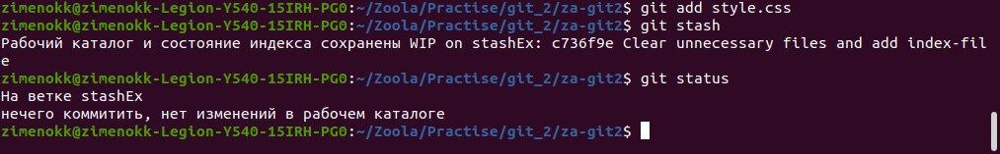
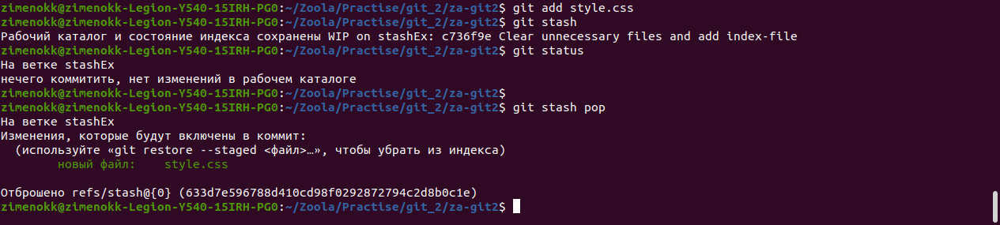

# Task 3: Use your imagination

My imagination sometimes creates something cool, but **not this time**. So I'll show you how to use the `git stash` command. 
`Git stash` is a standard git command that allows you to save local uncommented changes while resetting the working copy state to HEAD. When we type `git stash` into a terminal line, we "stash" all local changes, giving us a clean working copy that we can `git pull` into without having to worry about creating unnecessary merges. 
It's a dream, not a command - we can manage changes that we haven't committed. You can also compare this command a bit to `git tags`, because both allow you to save a specific version of code and then quickly change it to the next version. Yes, you can say that you can roll back to a certain comit, etc. But it's cool to have your own little uncommited secret and use it when the time comes.
### Some popular `git stash` commands

**`git stash`** --- add the current uncommitted changes to the change stack and reset the current working copy to the HEAD of the repository;

**`git stash list`** --- show all changes in the stack;

**`git stash show`** --- show the last change in the stack (patch);

**`git stash apply`** --- apply the latest change from the stack to the current working copy;

**`git stash drop`** --- remove the last change from the stack;

**`git stash pop`** --- apply the last change from the stack to the current working copy and remove it from the stack;

**`git stash clear`** --- clear the change stack.

### Let's try it:

A new branch especially for `git stash`.

 

Added a new file and entered `git status`

 

After entering `git stash`

 

With the `git stash pop` I applied the delayed changes.

 

So I showed the basic functionality of the `git stash` command, which I think is cool.