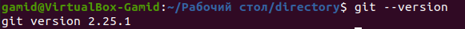
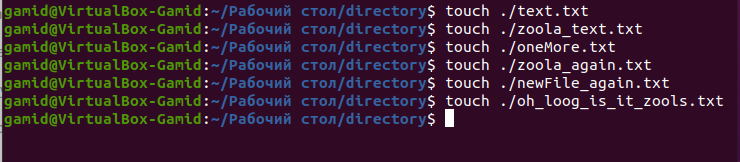
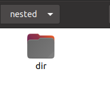
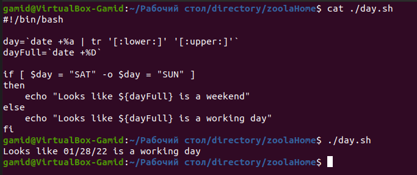

## Task 0

## Task 1

## Task 2

The directory is changed in the child process of script, not in the terminal process from which the script is called. After the child process dies, you are back in the terminal which is left where it was.

## Task 3

## Task 4

